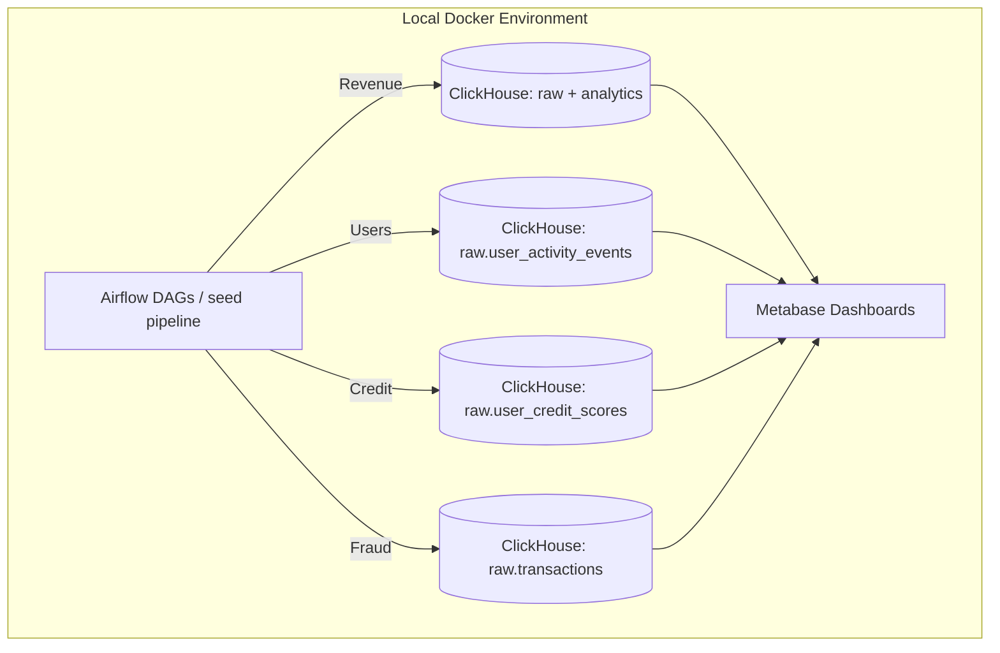

# Analytics Lab: Transaction Processing & BI Workflow

Shared local analytics environment for the Data Team. Every team member builds a vertical slice of the data platform: ingesting or generating data via an Apache Airflow DAG, modeling it in ClickHouse, and visualizing it in Metabase.

## 🏗 System Architecture



## 🛠 Tech Stack & Fixed Versions

* **Airflow:** `3.3.1`
* **ClickHouse:** `26.8.1.2041`
* **Metabase:** `v0.62.18.4`
* **PostgreSQL:** `16` (metadata storage)
* **Redis:** `7.2-bookworm` (Celery broker)

---

## 🚀 Quickstart Guide

### 1. Prerequisites

* **Docker Desktop**
* **Git**

### 2. Initialization & Boot

```bash
# Copy the environment template
cp .env.example .env

# Boot the environment in the background
docker compose up -d
```

### 3. Service Access Endpoints & Credentials

* **Airflow UI:** [http://localhost:8080](http://localhost:8080)
* **User:** `airflow` | **Password:** `airflow`

* **Metabase UI:** [http://localhost:3000](http://localhost:3000)
* **App Login:** Setup required on first boot.
* **Internal DB Connection:** Host: `postgres` | User: `metabase` | Pass: `metabase` | DB: `metabase`

* **ClickHouse HTTP:** [http://localhost:8123](http://localhost:8123)
* **User:** `default` | **Password:** *(Leave blank)*

* **ClickHouse Native Interface:** `localhost:9000`

---

## 📊 Available Seed Data

The seeded banking pipeline creates a synthetic but realistic transaction dataset for the lab. The current raw layer includes:

* `raw.users` — customer profile data, including age, income band, baseline credit score, and join date
* `raw.merchants` — merchant IDs, names, and categories
* `raw.transactions` — payment transactions with amount, timestamp, merchant/user references, and status
* `raw.user_activity_events` — synthetic login, browsing, checkout, and session events for user behavior and retention analysis
* `raw.user_credit_scores` — one current synthetic credit profile per user with a score, risk band, income band, monthly spend, and eligibility flag for credit-risk modeling

The data is intentionally generated in code so every domain task can be implemented without relying on external data sources.

---

## 👥 Team Tasks: End-to-End Analytics

Each member works on one domain end-to-end. Every task must include:

1. An Airflow pipeline change or additional DAG logic to ingest or generate the required data.
2. One or more ClickHouse models or transformations that turn raw data into useful analytics tables.
3. A Metabase dashboard or visualization that answers a business question from the transformed data.

### 👤 Member 1: Revenue & Transaction Volume

* **Branch Prefix:** `feature/m1-revenue`
* **Focus:** measure value generated from customer spending and transaction patterns.
* **Business question:** *How much money is moving through the platform, which categories drive it, and how does transaction performance change over time?*
* **Source data:** Use the existing `raw.transactions` table for amount, timestamp, user, merchant, and status, joined to `raw.merchants` for category. Do not generate a second transaction dataset.
* **Hands-on tasks:**

    1. **Airflow:** Create or extend a domain DAG that runs the revenue transformations in dependency order. It should create the required `analytics` database and tables, load the available transaction data, and be rerunnable without double-counting the same source transactions.
    2. **ClickHouse:** Build a layered model:
       * `analytics.transaction_facts`, a cleaned transaction model with a normalized transaction status, transaction date, and merchant category;
       * `analytics.daily_revenue`, with daily completed revenue, transaction count, average transaction amount, and failed/refunded counts;
       * `analytics.category_revenue`, with daily metrics by merchant category.
    3. **Modeling rules:** Define which statuses count as revenue and document how failed and refunded transactions are treated. Preserve the transaction grain in the fact model and use stable keys and appropriate MergeTree ordering.
    4. **Validate the model:** Reconcile fact-row counts and completed revenue to `raw.transactions`, check that every transaction has a merchant category, and verify that daily totals equal the sum of category totals.
    5. **Metabase:** Build a **"Revenue Overview"** dashboard with total completed revenue, transaction count, daily revenue trend, category comparison, average transaction amount, and a table of the highest-value days or categories.
* **Expected deliverables:** Airflow DAG code, ClickHouse DDL and transformation SQL, validation queries, and a dashboard screenshot or export. Include the status treatment and one reconciliation result in the PR.

### 👤 Member 2: User Activity & Retention

* **Branch Prefix:** `feature/m2-users`
* **Focus:** understand customer engagement and retention using event-level user behavior data.
* **Business question:** *How are customers using the platform, which channels and activities are most common, and do users return after joining?*
* **Source data:** Use the existing `raw.user_activity_events` table for event time, event type, channel, session, and user, joined to `raw.users` for join date. Do not generate replacement events.
* **Hands-on tasks:**

    1. **Airflow:** Create or extend a domain DAG that runs the activity transformations in dependency order. It should create the required `analytics` database and tables, process the existing events, and be rerunnable without duplicating the same source event.
    2. **ClickHouse:** Build a layered model:
       * `analytics.user_activity_facts`, a cleaned event model with event date, event month, and normalized activity fields;
       * `analytics.daily_user_activity`, with daily active users, event counts, session counts, and activity counts by event type and channel;
       * `analytics.user_retention_cohorts`, assigning users to a join-month cohort and reporting users active in later months.
    3. **Modeling rules:** Define an active user as a user with at least one event on a day, define how sessions are counted, and explain how `is_new_user` is checked against `raw.users.join_date`. Keep event grain separate from daily and cohort aggregates.
    4. **Validate the model:** Check that activity fact rows reconcile to the raw event count, active users do not exceed the distinct users in the source, session counts are sensible, and cohort totals reconcile to the user population included in the analysis window.
    5. **Metabase:** Build a **"User Growth"** dashboard with daily active users, event and session trends, activity by type and channel, new-user volume, and a retention cohort view.
* **Expected deliverables:** Airflow DAG code, ClickHouse DDL and transformation SQL, validation queries, and a dashboard screenshot or export. Include the active-user definition and one cohort reconciliation result in the PR.

### 👤 Member 3: Credit Risk & Loan Eligibility

* **Branch Prefix:** `feature/m3-credit-scoring`
* **Focus:** demonstrate how customer data and transaction behavior can inform credit risk and eligibility decisions.
* **Business question:** *How many customers qualify for lending under the supplied score and income rules, and what customer behavior should a lender review before making a decision?*
* **Source data:** Use the existing one-row-per-user `raw.user_credit_scores` table for the supplied score, risk band, eligibility flag, income band, and monthly spend. Join to `raw.users` for customer attributes and aggregate `raw.transactions` for transaction count, completed spend, failed count, and most recent transaction date. Do not create a new ML score or pretend the current table contains score history.
* **Hands-on tasks:**

     1. **Airflow:** Create a domain DAG that runs the credit transformations in dependency order. It should create the required `analytics` database and tables, process the existing credit, user, and transaction data, and be rerunnable without duplicating the modeled user records.
     2. **ClickHouse:** Build a layered model:
         * `analytics.user_credit_facts`, one row per user containing the supplied credit fields plus derived transaction behavior features;
         * `analytics.latest_user_credit_profile`, the current decision-ready user profile. Here "latest" means the current row identified by the supplied `score_date`; it is not a historical deduplication exercise;
         * `analytics.credit_risk_summary`, with customer count, average score, eligible count, eligibility rate, and completed spend by risk band and income band.
     3. **Modeling rules:** Use the supplied `loan_eligible` flag as the source decision and document the existing synthetic rule: eligible when `credit_score >= 640` and income band is `Medium-High` or `High`. Add a derived review segment using transaction behavior, such as low, medium, or high activity, but do not call it an ML prediction or replace the supplied eligibility flag.
     4. **Validate the model:** Check that there is one credit profile per user, no credit rows lose their user or transaction join unexpectedly, the modeled eligibility count matches `raw.user_credit_scores`, and summary totals reconcile to the profile model.
     5. **Metabase:** Build a **"Credit Risk"** dashboard with eligible-user count and rate, score distribution, risk-band and income-band segmentation, activity/spend comparison by eligibility, and a review table containing user, score date, score, income band, monthly spend, transaction features, risk band, and eligibility.
* **Expected deliverables:** Airflow DAG code, ClickHouse DDL and transformation SQL, validation queries, and a dashboard screenshot or export. Include the eligibility rule, one profile-level reconciliation result, and one example of a customer whose transaction behavior provides useful lending context.

### 👤 Member 4: Fraud Detection & Anomalies

* **Branch Prefix:** `feature/m4-fraud`
* **Focus:** identify suspicious or abnormal payment behavior using the transaction dataset.
* **Business question:** *Which transactions deserve operational review, what rule explains each flag, and where are suspicious patterns concentrated?*
* **Source data:** Use the existing `raw.transactions` table for amounts, timestamps, users, merchants, and statuses, joined to `raw.merchants` for category. The seeded statuses and amounts already support rule-based anomaly analysis. Do not build an ML model or require new synthetic fraud labels.
* **Hands-on tasks:**

    1. **Airflow:** Create or extend a domain DAG that runs the fraud transformations in dependency order. It should create the required `analytics` database and tables, process the existing transactions, and be rerunnable without duplicating the same transaction alerts.
    2. **ClickHouse:** Build a layered model:
       * `analytics.transaction_risk_facts`, one row per transaction with amount bands, failure/refund indicators, user-day counts, and merchant-category context;
       * `analytics.fraud_alerts`, containing one row per flagged transaction and a clear `alert_reason` such as unusually large amount, repeated failed payment, refunded payment, or high user-day transaction volume;
       * `analytics.fraud_risk_summary`, with alert count, alert rate, failed/refunded count, and transaction amount by day, category, and alert reason.
    3. **Modeling rules:** Define deterministic thresholds from the available data, such as an amount above a documented percentile or repeated failures for the same user and day. Keep each rule explainable, allow one transaction to have multiple reasons without losing the transaction grain, and distinguish an operational alert from a confirmed fraud case.
    4. **Validate the model:** Check that every alert maps to a source transaction, every alert has at least one reason, alert counts reconcile to the rule conditions, and daily/category summaries reconcile to `analytics.fraud_alerts`.
    5. **Metabase:** Build a **"Trust & Safety"** dashboard with flagged transaction count and rate, alert trend, reason breakdown, category and merchant concentration, amount distribution, and a review table with transaction, user, merchant, amount, time, status, and alert reasons.
* **Expected deliverables:** Airflow DAG code, ClickHouse DDL and transformation SQL, documented rule thresholds, validation queries, and a dashboard screenshot or export. Include one example for each alert rule and explain why the result is an alert rather than a confirmed fraud label.

---

## 🤝 Collaboration Protocol (GitHub-Based)

Direct pushes to `prod` are not allowed. Every change must go through the GitHub review process.

1. Create a feature branch for the assigned domain work.
2. Push the branch and open a Pull Request (PR) targeting `prod`.
3. Assign one team member as the reviewer.
4. The reviewer checks the implementation, validates it locally where appropriate, and either requests changes or approves the PR.
5. Once the reviewer approves, assign the PR to **Alireza** for the final review.
6. Only after **Alireza** approves should the PR be merged into `prod`.
7. The `prod` branch must remain protected and not accept direct pushes.

### GitHub Pull Request Template

**`.github/pull_request_template.md`**

```markdown
## Summary

<!-- Describe the domain pipeline completed in this branch -->

## Verification Checklist

- [ ] Code tested locally against the pinned Docker environment.
- [ ] Airflow DAG runs successfully without task failures.
- [ ] ClickHouse tables created and populated correctly.
- [ ] Metabase dashboard built and validated.

## Reviewer Assignment

- [ ] Reviewer assigned.
- [ ] Reviewer approved.
- [ ] Alireza assigned for final review.
- [ ] Alireza approved.
```

---

## 📂 Repository Structure

```text
analytics-lab/
├── .github/
│   ├── pull_request_template.md
├── .env.example
├── docker-compose.yml
├── docker-compose.override.yml
├── config/
│   └── clickhouse/users.d/default-user.xml
├── scripts/
│   ├── clickhouse-init.sql
│   └── postgres-init.sql
├── airflow/
│   ├── dags/
│   │   ├── seed_banking_raw_data.py
│   │   └── utils/
│   │       ├── clickhouse_manager.py
│   │       └── models.py
│   └── logs/
├── README.md
└── pyproject.toml
```

---

## 💻 Implementation Template

Use this blueprint as a starting point, but adapt it to the domain and the available generated data. The exact implementation is intentionally left open for each team member.

### 1. Airflow DAG Pattern

```python
from airflow.decorators import dag, task
from datetime import datetime

@dag(
    dag_id='domain_pipeline',
    schedule='@daily',
    start_date=datetime(2026, 1, 1),
    catchup=False,
    tags=['analytics']
)
def domain_pipeline():
    @task
    def ingest_or_generate_data():
        pass

    @task
    def transform_data():
        pass

    ingest_or_generate_data() >> transform_data()

domain_pipeline()
```

### 2. ClickHouse Model Pattern

```sql
CREATE TABLE IF NOT EXISTS analytics.domain_metrics (
    date Date,
    metric_name String,
    metric_value Float64
) ENGINE = SummingMergeTree()
ORDER BY (date, metric_name);

INSERT INTO analytics.domain_metrics
SELECT
    toDate(transaction_time) AS date,
    'total_volume' AS metric_name,
    sum(amount) AS metric_value
FROM raw.transactions
GROUP BY date;
```

### 3. Metabase Dashboard Expectations

A successful dashboard should answer a clear business question with a small set of focused visuals, such as:

* a KPI or single-value card,
* a trend or distribution chart,
* a segmentation or comparison view,
* a table or breakdown for anomaly or risk review.

The goal is not a single prescribed chart layout, but a useful and explainable result grounded in the generated data.
