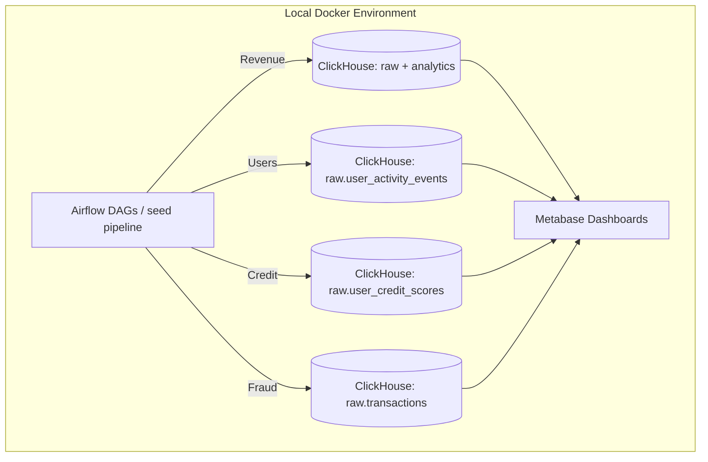

# Analytics Lab: Transaction Processing & BI Workflow

Shared local analytics environment for the Data Team. Every team member builds a vertical slice of the data platform: ingesting or generating data via an Apache Airflow DAG, modeling it in ClickHouse, and visualizing it in Metabase.

## 🏗 System Architecture



## 🛠 Tech Stack & Fixed Versions

* **Airflow:** `3.3.1`
* **ClickHouse:** `26.8.1.2041`
* **Metabase:** `v0.62.18.4`
* **PostgreSQL:** `16` (metadata storage)
* **Redis:** `7.2-bookworm` (Celery broker)

---

## 🚀 Quickstart Guide

### 1. Prerequisites

* **Docker Desktop**
* **Git**

### 2. Initialization & Boot

```bash
# Copy the environment template
cp .env.example .env

# Boot the environment in the background
docker compose up -d
```

### 3. Service Access Endpoints & Credentials

* **Airflow UI:** [http://localhost:8080](http://localhost:8080)
* **User:** `admin` | **Password:** `admin`

* **Metabase UI:** [http://localhost:3000](http://localhost:3000)
* **App Login:** Setup required on first boot.
* **Internal DB Connection:** Host: `postgres` | User: `metabase` | Pass: `metabase` | DB: `metabase`

* **ClickHouse HTTP:** [http://localhost:8123](http://localhost:8123)
* **User:** `default` | **Password:** *(Leave blank)*

* **ClickHouse Native Interface:** `localhost:9000`

---

## 📊 Available Seed Data

The seeded banking pipeline creates a synthetic but realistic transaction dataset for the lab. The current raw layer includes:

* `raw.users` — customer profile data, including age, income band, baseline credit score, and join date
* `raw.merchants` — merchant IDs, names, and categories
* `raw.transactions` — payment transactions with amount, timestamp, merchant/user references, and status
* `raw.user_activity_events` — synthetic login, browsing, checkout, and session events for user behavior and retention analysis
* `raw.user_credit_scores` — synthetic credit snapshots with a risk band and eligibility flag for credit-risk modeling

The data is intentionally generated in code so every domain task can be implemented without relying on external data sources.

---

## 👥 Team Tasks: End-to-End Analytics

Each member works on one domain end-to-end. Every task must include:

1. An Airflow pipeline change or additional DAG logic to ingest or generate the required data.
2. One or more ClickHouse models or transformations that turn raw data into useful analytics tables.
3. A Metabase dashboard or visualization that answers a business question from the transformed data.

### 👤 Member 1: Revenue & Transaction Volume

* **Branch Prefix:** `feature/m1-revenue`
* **Focus:** measure value generated from customer spending and transaction patterns.
* **Tasks:**

1. **Airflow:** Build or extend a DAG to work with the seeded transaction stream and any supporting transformation steps.
2. **ClickHouse:** Model daily revenue, transaction count, and category-level movement in `analytics.daily_revenue` or an equivalent fact table.
3. **Metabase:** Build a **"Revenue Overview"** dashboard with a headline KPI and a trend chart that highlights daily volume and revenue patterns.

### 👤 Member 2: User Activity & Retention

* **Branch Prefix:** `feature/m2-users`
* **Focus:** understand customer engagement and retention using event-level user behavior data.
* **Tasks:**

1. **Airflow:** Use or extend the seed pipeline to generate and load user events such as logins, app activity, browsing, or checkout events.
2. **ClickHouse:** Create a user activity model that summarizes active users, new users, and retention cohorts over time.
3. **Metabase:** Build a **"User Growth"** dashboard showing active users, new registrations, and retention trends over a rolling time window.

### 👤 Member 3: Credit Risk & Loan Eligibility

* **Branch Prefix:** `feature/m3-credit-scoring`
* **Focus:** demonstrate how customer data and transaction behavior can inform credit risk and eligibility decisions.
* **Tasks:**

1. **Airflow:** Build or extend a DAG to generate or refresh synthetic credit snapshots, eligibility signals, and supporting risk data.
2. **ClickHouse:** Create a model that keeps the latest score per user, summarizes risk bands, and exposes eligibility thresholds.
3. **Metabase:** Build a **"Credit Risk"** dashboard showing score distribution, risk segmentation, and eligibility thresholds for lending decisions.

### 👤 Member 4: Fraud Detection & Anomalies

* **Branch Prefix:** `feature/m4-fraud`
* **Focus:** identify suspicious or abnormal payment behavior using the transaction dataset.
* **Tasks:**

1. **Airflow:** Extend the pipeline to stage or flag transaction risk signals from the transaction feed.
2. **ClickHouse:** Build a fraud model or alert table that highlights abnormal amounts, repeated failures, status anomalies, or merchant-driven risk patterns.
3. **Metabase:** Build a **"Trust & Safety"** dashboard featuring flagged transactions and a breakdown of risk or block reasons.

---

## 🤝 Collaboration Protocol (GitHub-Based)

Direct pushes to `prod` are not allowed. Every change must go through the GitHub review process.

1. Create a feature branch for the assigned domain work.
2. Push the branch and open a Pull Request (PR) targeting `prod`.
3. Assign one team member as the reviewer.
4. The reviewer checks the implementation, validates it locally where appropriate, and either requests changes or approves the PR.
5. Once the reviewer approves, assign the PR to **Alireza** for the final review.
6. Only after **Alireza** approves should the PR be merged into `prod`.
7. The `prod` branch must remain protected and not accept direct pushes.

### GitHub Pull Request Template

**`.github/pull_request_template.md`**

```markdown
## Summary

<!-- Describe the domain pipeline completed in this branch -->

## Verification Checklist

- [ ] Code tested locally against the pinned Docker environment.
- [ ] Airflow DAG runs successfully without task failures.
- [ ] ClickHouse tables created and populated correctly.
- [ ] Metabase dashboard built and validated.

## Reviewer Assignment

- [ ] Reviewer assigned.
- [ ] Reviewer approved.
- [ ] Alireza assigned for final review.
- [ ] Alireza approved.
```

---

## 📂 Repository Structure

```text
analytics-lab/
├── .github/
│   ├── pull_request_template.md
├── .env.example
├── docker-compose.yml
├── docker-compose.override.yml
├── config/
│   └── clickhouse/users.d/default-user.xml
├── scripts/
│   ├── clickhouse-init.sql
│   └── postgres-init.sql
├── airflow/
│   ├── dags/
│   │   ├── seed_banking_raw_data.py
│   │   └── utils/
│   │       ├── clickhouse_manager.py
│   │       └── models.py
│   └── logs/
├── README.md
└── pyproject.toml
```

---

## 💻 Implementation Template

Use this blueprint as a starting point, but adapt it to the domain and the available generated data. The exact implementation is intentionally left open for each team member.

### 1. Airflow DAG Pattern

```python
from airflow.decorators import dag, task
from datetime import datetime

@dag(
    dag_id='domain_pipeline',
    schedule='@daily',
    start_date=datetime(2026, 1, 1),
    catchup=False,
    tags=['analytics']
)
def domain_pipeline():
    @task
    def ingest_or_generate_data():
        pass

    @task
    def transform_data():
        pass

    ingest_or_generate_data() >> transform_data()

domain_pipeline()
```

### 2. ClickHouse Model Pattern

```sql
CREATE TABLE IF NOT EXISTS analytics.domain_metrics (
    date Date,
    metric_name String,
    metric_value Float64
) ENGINE = SummingMergeTree()
ORDER BY (date, metric_name);

INSERT INTO analytics.domain_metrics
SELECT
    toDate(transaction_time) AS date,
    'total_volume' AS metric_name,
    sum(amount) AS metric_value
FROM raw.transactions
GROUP BY date;
```

### 3. Metabase Dashboard Expectations

A successful dashboard should answer a clear business question with a small set of focused visuals, such as:

* a KPI or single-value card,
* a trend or distribution chart,
* a segmentation or comparison view,
* a table or breakdown for anomaly or risk review.

The goal is not a single prescribed chart layout, but a useful and explainable result grounded in the generated data.
