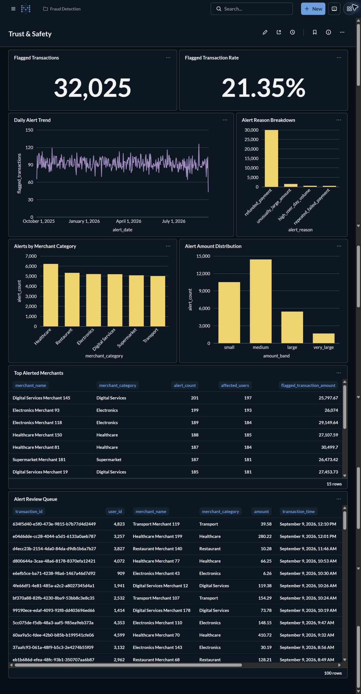

# Member 4: Fraud Detection & Anomalies

This deliverable answers the question: **Which transactions deserve operational
review, what rule explains each flag, and where are suspicious patterns
concentrated?** A flag is an explainable review signal; it is not a confirmed
fraud label.

## Implementation

The `fraud_detection` Airflow DAG uses Airflow 3 TaskFlow decorators and runs the
following idempotent steps in order:

1. Check that `raw.transactions` and `raw.merchants` exist and contain data.
2. Create the `analytics` database when it does not exist.
3. Replace `analytics.transaction_risk_facts` at transaction grain.
4. Replace `analytics.fraud_alerts` at flagged-transaction grain.
5. Replace `analytics.fraud_risk_summary` at date, merchant-category, and
   individual-reason grain.
6. Run reconciliation checks and fail the DAG if any result differs from its
   expected value.

Shared connection code remains in `airflow/dags/utils`, and all model and
validation SQL remains in `airflow/dags/sql/fraud_detection`. Both locations are
inside the existing `/opt/airflow/dags` mount, so this task adds no Compose mount
or Python path configuration.

## Alert rules

| Rule | Deterministic condition |
| --- | --- |
| `unusually_large_amount` | Amount is greater than the exact 99th percentile of the current source dataset. |
| `repeated_failed_payment` | Status is `failed` and the user has at least two failed transactions on the same day. |
| `refunded_payment` | Normalized transaction status is `refunded`. |
| `high_user_day_volume` | The user has at least three transactions on the same day. |

`alert_reasons` is an array, so a transaction can retain more than one reason
without creating duplicate transaction rows. `alert_reason` is the
display-friendly, comma-separated form used in Metabase.

## Verified result

The DAG was tested end-to-end against the pinned local environment on
2026-09-12. All six tasks succeeded and all 14 validation checks passed.

| Check | Result |
| --- | ---: |
| Source transaction rows | 150,000 |
| Transaction fact rows | 150,000 |
| Flagged transactions | 32,025 |
| Flagged transaction rate | 21.35% |
| Exploded reason rows | 32,485 |
| Unresolved merchant categories | 0 |
| Alerts without a source transaction | 0 |
| Alerts without a reason | 0 |
| Summary reconciliation differences | 0 |

For this source snapshot, the exact 99th-percentile amount is approximately
`550.60`. Reason counts are not additive to the unique flagged-transaction total
because one transaction can match multiple rules.

| Alert reason | Count |
| --- | ---: |
| `refunded_payment` | 29,952 |
| `unusually_large_amount` | 1,499 |
| `high_user_day_volume` | 545 |
| `repeated_failed_payment` | 489 |

## Example alerts

These examples come from the verified source snapshot. UUIDs can change when the
synthetic seed DAG is rerun, but the deterministic rule definitions do not.

| Rule demonstrated | Transaction | Evidence |
| --- | --- | --- |
| `unusually_large_amount` | `fdbf8e6c-def8-4cbd-98fb-d8c84cdab613` | Completed transaction for `1,416.95`, above the `550.60` threshold. |
| `repeated_failed_payment` | `7d0a811d-7947-442f-9066-76bc51e40d01` | Failed payment by a user with at least two failures that day; it also matched the high-volume rule. |
| `refunded_payment` | `634f5d40-e5f0-473e-9815-b7b77d4d2449` | Source status normalized to `refunded`. |
| `high_user_day_volume` | `4fe66df1-4e81-485a-a2c2-a8027345d4a1` | User made at least three transactions that day; this transaction was also refunded. |

Each example is a reason to place the payment in an operational review queue.
None of the source tables contains a confirmed-fraud label, so these results
must not be interpreted as fraud predictions or final case decisions.

## Metabase dashboard

The **Trust & Safety** dashboard contains eight focused cards:

- flagged transaction count and rate;
- daily alert trend and alert-reason breakdown;
- merchant-category and merchant concentration;
- alert amount-band distribution;
- a transaction-level review queue with transaction, user, merchant, amount,
  time, normalized status, and all alert reasons.
